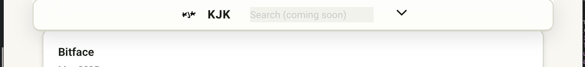

<!-- filepath: /Users/kamil/Desktop/kjk-astro/CONTINUE_SESSION_PROMPT.md -->

# PROJECT ALIGNMENT DIRECTIVE

---

## RULES AND CONSTRAINTS (SOURCE OF TRUTH)

> **How to Use:**
>
> - Reference rules and constraints for all visual/style changes.
> - Add new tokens or exceptions here before use.
> - Use comments to reference relevant rules/tokens in code.

### Design Token Reference Table

| Token Type   | Name/Variable                   | Example Value(s)                                  |
| ------------ | ------------------------------- | ------------------------------------------------- |
| Font         | --font-family-base              | "Roboto", system-ui, ...                          |
| Font Weight  | --font-weight-regular, bold     | 400, 700                                          |
| BG Color     | --color-bg                      | #f8f7f2 (light), #121212 (dark)                   |
| Text Color   | --color-text                    | #181c17 (light), #fff (dark)                      |
| Accent       | --color-accent                  | #39ff14                                           |
| Border       | --border-unified                | 1px solid var(--color-border)                     |
| Border Color | --color-border                  | #d6d5c9 (light), #333333 (dark)                   |
| Border Rad.  | --radius-unified, --radius-card | 12px, 16px                                        |
| Spacing      | --fluid-space-m, --space-m      | clamp(16px, 1.5vw, 32px), 1.5rem                  |
| Shadow       | --shadow-elevation-2            | 0 2px 8px 0 var(--shadow-color)                   |
| Frosted      | --frosted-bg, --frosted-blur    | rgba(255,255,255,0.72), blur(18px) saturate(180%) |

### Core Visual & Layout Rules

- Use tokens for fonts, colors, spacing, borders, and shadows.
- Ensure accessibility and responsiveness.
- Avoid hardcoded pixel values except in tokens.
- Center all major elements.

---

## NEXT STEPS

1. Run `npm run dev`.
2. Execute alignment tests.
3. Continue with modular test updates.
