# Astro Portfolio & Media Gallery

This project is a modular, responsive web application built with [Astro](https://astro.build/). It serves as a personal portfolio and interactive media/game gallery, with a focus on extensibility, content filtering, and a clean, card-based UI.

---

## 🗂️ Entity Model & Relationships

### **Entities**

- **MainLayout**: The root layout for all pages. Contains the Navbar and the main content area.
- **Navbar**: Floating or fixed navigation bar. Controls filtering of media types in the CardGrid and loads the AboutGrid.
- **CardGrid**: The main content area. Always loads all cards by default, displaying them in a responsive grid (single column on mobile, multi-column on larger screens). Filtering is controlled by the Navbar.
- **CardPrimitive**: The base card component. All card types (CardBook, CardMusic, CardGame, CardApp, CardDoc, CardLink, etc.) extend this primitive. Each card displays the minimum info to describe a file: if frontmatter is present, uses title and abstract; otherwise, falls back to filename.
- **AboutGrid**: Special grid loaded via the Navbar's About link. Contains cards about the author, site colophon, and other meta information.
- **File**: Content source for cards. May contain frontmatter (title, abstract, mediaType).
- **Device**: Represents the responsive environment (mobile, tablet, desktop).

### **Relationships & Flow**

```mermaid
flowchart LR

%%{init: {
  "theme": "dark",
  "themeVariables": {
    "darkMode": true,
    "fontFamily": "JetBrains Mono, Fira Code, monospace",
    "fontSize": "15px",

    "background": "#0e0f11",
    "mainBkg": "#101010",
    "primaryColor": "#18181b",
    "primaryTextColor": "#f5f5f5",
    "primaryBorderColor": "#FFD700",

    "secondaryColor": "#232323",
    "secondaryTextColor": "#f5f5f5",
    "secondaryBorderColor": "#FFD700",

    "tertiaryColor": "#101010",
    "tertiaryTextColor": "#f5f5f5",
    "tertiaryBorderColor": "#FFD700",

    "lineColor": "#FFD700",
    "titleColor": "#FFD700",
    "nodeTextColor": "#f5f5f5",
    "noteTextColor": "#b3b3b3",
    "edgeLabelBackground": "#0e0f11",

    "clusterBkg": "#18181b",
    "clusterBorder": "#FFD700",
    "mainContrastColor": "#FFD700",

    "actorBorder": "#FFD700",
    "actorBkg": "#18181b",
    "actorTextColor": "#FFD700",
    "labelBoxBkg": "#101010",
    "labelBoxBorder": "#FFD700",
    "altSectionBkg": "#232323",
    "altSectionBkg2": "#18181b",

    "shadow1": "0 0 0 transparent",
    "textAlign": "left"
  }
}}%%

%% MAIN FLOW (left to right)
  %% 1. Layout
  subgraph Layout[Layout]
    direction LR
    MainLayout["<b>MainLayout</b><br/><code>src/layouts/MainLayout.astro</code>"]:::siteInteractionColor
    Navbar["<b>Navbar</b><br/><code>src/components/Navbar.astro</code>"]:::userInteractionColor
    MainContent["<b>Main Content</b><br/><code>src/pages/index.astro</code><br/><code>src/pages/posts/*.md</code>"]:::contentColor
  end

  %% 2. Content
  subgraph Content[Content & Data]
    direction LR
    AboutGrid["<b>AboutGrid</b><br/><code>src/components/AboutGrid.astro</code>"]:::contentColor
    File["<b>File</b><br/><code>src/pages/posts/*.md</code>"]:::contentColor
    Frontmatter["<b>Frontmatter</b> in .md"]:::contentColor
  end

  %% 3. Media
  subgraph MediaCards[Media Cards]
    direction LR
    CardGrid["<b>CardGrid</b><br/><code>src/components/CardGrid.astro</code>"]:::siteInteractionColor
  end

  %% 4. Interaction
  subgraph Interaction[User Interaction]
    direction LR
    FocusedCard["<b>FocusedCard</b><br/><code>src/components/FocusedCard.astro</code>"]:::userInteractionColor
  end

  %% Connections
  Layout --> Content
  Content --> MediaCards
  MediaCards --> Interaction

  MainLayout --> Navbar
  MainLayout -->|Default| CardGrid
  Navbar -->|Media filters| CardGrid
  Navbar -->|About| AboutGrid
  MainContent --> AboutGrid
  MainContent --> CardGrid

  CardGrid ---|Uses media queries| GlobalCSS["<b>GlobalCSS</b><br/><code>src/assets/global.css</code>"]:::siteInteractionColor
  FocusedCard -. "Close/Back" .-> CardGrid

%% CARD PRIMITIVES TO THE RIGHT
subgraph CardPrimitives[Card Primitives]
  direction LR
  CardPrimitive["<b>CardPrimitive</b><br/><code>src/components/Card.astro</code>"]:::contentColor

  subgraph CardVarieties[Varieties]
    direction LR
    CardVarietiesBox["CardBook.astro<br/>CardMusic.astro<br/>CardGame.astro<br/>CardApp.astro<br/>CardDoc.astro<br/>CardLink.astro<br/>CardOther.astro"]:::contentColor
  end

  CardPrimitive --> CardVarieties
end

%% CROSS-CONNECTIONS
File -->|Has FM| Frontmatter
CardGrid -->|Uses| CardPrimitive
CardPrimitive -. "handles clicks" .-> FocusedCard

classDef siteInteractionColor fill:#1a2b1d,stroke:#39ff14,color:#39ff14,stroke-width:1px;
classDef userInteractionColor fill:#1f2f25,stroke:#00ffe7,color:#00ffe7,stroke-width:1px;
classDef contentColor fill:#101618,stroke:#39ff14,color:#e6ffe5,stroke-width:1px;
classDef highlightColor fill:#162c1f,stroke:#39ff14,color:#00ffe7,stroke-width:1px;
classDef focusColor fill:#1c1c1c,stroke:#00ffe7,color:#39ff14,stroke-width:1px;
```



---

## 🧩 Card Primitive

- **Purpose**: Serves as the template for all card types.
- **Fields**:
  - `title`: From frontmatter, or filename if missing
  - `abstract`: From frontmatter, or blank if missing
  - `mediaType`: From frontmatter, used for filtering
  - `filename`: Used as fallback display
- **Extensible**: Specialized cards (Book, Music, Game, App, Doc, Link, Other) inherit from CardPrimitive and can add custom fields/styles.

---

## 🗂️ Filtering & About Grid

- **Filtering**: Navbar toggles visibility of mediaTypes in CardGrid. All cards are shown by default; users can hide/show types interactively.
- **AboutGrid**: Triggered by the About link/icon in Navbar. Displays cards about the author, site colophon, and other meta content.

---

## 📱 Responsive Design

- **Mobile**: CardGrid is single-column.
- **Tablet/Desktop**: CardGrid increases columns based on screen size.
- **Adaptive**: Layout and Navbar adjust for device width.

---

## 📦 Project Structure (Summary)

```
/ (root)
├── public/
│   ├── favicon.svg, images, fonts
│   └── games/
│       └── <game>/ (HTML5 games)
├── src/
│   ├── assets/ (global.css)
│   ├── components/ (Astro UI)
│   ├── layouts/ (MainLayout)
│   ├── pages/ (index, posts)
│   └── scripts/ (theme toggle)
├── astro.config.mjs
├── package.json
└── README.md
```

---

## 🛠️ Development Manifest

Below is a manifest of items to develop or refactor to fully realize the architecture:

- [ ] **Refactor Sidebar.astro to Navbar.astro**
  - Make navigation generic (not sidebar-specific)
  - Add About link/icon (e.g., question mark icon)
  - Implement mediaType filter controls
- [ ] **Implement CardBook.astro, CardMusic.astro, CardGame.astro, CardApp.astro, CardDoc.astro, CardLink.astro, CardOther.astro**
  - Extend CardPrimitive for each type
  - Add custom fields/styles as needed
- [ ] **Implement AboutGrid.astro**
  - Loads when About is selected in Navbar
  - Contains cards for about, colophon, etc.
- [ ] **Implement FocusedCard.astro**
  - Modal/detail view for a card when clicked
  - Close/back returns to CardGrid
- [ ] **Enhance CardGrid.astro**
  - Filtering logic for mediaTypes
  - Responsive column logic (if not already present)
- [ ] **Update global.css**
  - Ensure responsive grid and Navbar styles
- [ ] **Update Card.astro (CardPrimitive)**
  - Ensure fallback to filename if no frontmatter
  - Expose base fields for extension
- [ ] **Update documentation as features are completed**

---

## 🛠️ Development

- Install: `npm install`
- Dev server: `npm run dev`
- Build: `npm run build`
- Preview: `npm run preview`

---

## 📖 Further Reading

- [Astro Documentation](https://docs.astro.build)
- [Vercel Deployment](https://vercel.com/docs)
