# 📘 Astro Site: Complete Architecture Views

This diagram provides a unified, high-level overview of the entire Astro site architecture. Each major section is a self-contained subgraph, and arrows between subgraphs indicate how different architectural concerns inform or depend on each other. Use this as a reference for understanding the flow of data, state, content, and rendering in the project.

- **State & Signals**: Manages UI state, user interactions, and theme toggling. Feeds into rendering logic.
- **Build Pipeline**: Handles content ingestion, parsing, styling, and deployment. Supplies processed content and components to the rendering system.
- **Routing & Navigation**: Defines how users move between pages and how navigation is handled in the UI. Informs the rendering layer about which components/pages to display.
- **Content Modeling**: Describes the schema and structure of content, including frontmatter fields and how they drive filtering, variants, and visibility. Supplies data to both the rendering and data/interaction layers.
- **Render & Composition**: The core rendering engine, assembling layouts, components, and content into the final UI. Receives input from state, routing, build, and content modeling.
- **Data & Interaction Flow**: Shows how content and state interact at runtime, including filtering, focus, and user-driven updates. Relies on content modeling and state management.

```mermaid
---
config:
  layout: elk
  theme: neutral
  fontfamily: 'Inter, sans-serif'
    
---
flowchart TB
  classDef defaultStyle stroke-width:2px,stroke-dasharray:0;
  classDef dashedStyle stroke-width:2px,stroke-dasharray:5 5;
  classDef boldStyle stroke-width:3px,stroke-dasharray:0;

 subgraph UI_Components["🧩 <b>UI Components</b>"]
        Navbar["<b>Navbar</b>"]
        CardPrimitive["<b>CardPrimitive</b>"]
        FocusedCard["<b>FocusedCard</b>"]
  end
 subgraph Stores["🧠 <b>State Stores &amp; Signals</b>"]
        FilterStore["<b>FilterStore</b> <br><code>(type, tag)</code>"]
        FocusState["<b>FocusState</b> <br><code>(activeCardSlug)</code>"]
        DarkModeSignal["<b>DarkMode</b> <br><code>(toggle/theme)</code>"]
  end
 subgraph StateSignals["🧠 <b>State &amp; Signals</b>"]
    direction TB
        UI_Components
        Stores
        MainLayoutS["<b>MainLayout</b>"]
  end
 subgraph BuildPipeline["⚙️ <b>Build Pipeline</b>"]
    direction LR
        Markdown["<b>Markdown</b> <br><code>posts/*.md</code>"]
        ContentConfig["<b>content.config.ts</b>"]
        RemarkPlugins["<b>remark/rehype plugins</b> <br><code>syntax, wiki-link, etc</code>"]
        AstroParser["<b>Astro Markdown Parser</b>"]
        ComponentsBP["<b>Components</b> <br><code>C  classDef defaultStyle stroke-width:1px,stroke-dasharray:0;
  classDef dashedStyle stroke-width:1px,stroke-dasharray:5 5;
  classDef boldStyle stroke-width:2px,stroke-dasharray:0;ardGrid, Layout, etc.</code>"]
        Tailwind["<b>TailwindCSS</b>"]
        GlobalCSS["<b>global.css</b>"]
        Vite["<b>Vite Dev Server</b>"]
        Vercel["<b>Vercel deploy &amp; edge cache</b>"]
  end
 subgraph RoutingNav["🔁 <b>Routing &amp; Navigation</b>"]
    direction TB
        Home["<b>/</b> <br><code>pages/index.astro</code>"]
        PostSlug["<b>/posts/[slug]</b> <br><code>pages/posts/[slug].astro</code>"]
        TagView["<b>/tags/[tag]</b>"]
        About["<b>/about</b> <br><code>components/AboutGrid.astro</code>"]
        NavbarRN["<b>Navbar</b>"]
        InternalLinks["<b>&lt;a href&gt;</b> <br>Client navigation"]
        CardGridRN["<b>CardGrid</b>"]
        CardPrimitiveRN["<b>CardPrimitive</b>"]
  end
 subgraph FrontmatterFields["<b>Fields</b>"]
        title["title"]
        description["description"]
        tags["tags"]
        type["type"]
        date["date"]
        mediaType["mediaType"]
        pinned["pinned"]
        draft["draft"]
  end
 subgraph ContentModel["📦 <b>Content Modeling</b>"]
    direction TB
        MarkdownFile["<b>Markdown File</b> <br><code>posts/*.md</code>"]
        Frontmatter["<b>Frontmatter Schema</b>"]
        FrontmatterFields
        CardVariantsCM["<b>CardVariants</b>"]
        FilterStoreCM["<b>FilterStore</b>"]
        CardGridCM["<b>CardGrid</b>"]
  end
 subgraph LayoutRC["<b>Layout &amp; Pages</b>"]
        MainLayoutRC["<b>MainLayout</b> <br><code>layouts/MainLayout.astro</code>"]
        NavbarRC["<b>Navbar</b> <br><code>components/Navbar.astro</code>"]
        IndexPage["<b>Index</b> <br><code>pages/index.astro</code>"]
        PostPage["<b>Post Page</b> <br><code>pages/posts/[slug].astro</code>"]
  end
 subgraph ComponentsRC["<b>Components</b>"]
        AboutGridRC["<b>AboutGrid</b> <br><code>components/AboutGrid.astro</code>"]
        CardGridRC["<b>CardGrid</b> <br><code>components/CardGrid.astro</code>"]
        CardPrimitiveRC["<b>CardPrimitive</b> <br><code>components/Card.astro</code>"]
        CardVariantsRC["<b>Variants</b> <br><code>CardBook, CardApp, ...</code>"]
        FocusedCardRC["<b>FocusedCard</b> <br><code>components/FocusedCard.astro</code>"]
  end
 subgraph RenderComp["🖼️ <b>Render &amp; Composition</b>"]
    direction TB
        LayoutRC
        ComponentsRC
  end
 subgraph DataDI["<b>Content &amp; Data</b>"]
        MarkdownFileDI["<b>Markdown</b> <br><code>posts/*.md</code>"]
        FrontmatterDI["<b>Frontmatter</b> <br><code>title, tags, type...</code>"]
  end
 subgraph StateDI["<b>State &amp; Interaction</b>"]
        FilterStoreDI["<b>FilterStore</b> <br><code>tag/type filter</code>"]
        FocusStateDI["<b>FocusState</b> <br><code>signal/store</code>"]
  end
 subgraph DataInteraction["🔄 <b>Data &amp; Interaction Flow</b>"]
    direction TB
        DataDI
        StateDI
        CardGridDI["<b>CardGrid</b>"]
        CardPrimitiveDI["<b>CardPrimitive</b>"]
        NavbarDI["<b>Navbar</b>"]
        FocusedCardDI["<b>FocusedCard</b>"]
  end
    Navbar -- sets --> FilterStore
    FilterStore -- filters --> CardPrimitive
    CardPrimitive -- onClick --> FocusState
    FocusState -- controls --> FocusedCard
    Navbar -- toggles --> DarkModeSignal
    MainLayoutS -- applies class --> DarkModeSignal
    Markdown --> ContentConfig
    ContentConfig --> AstroParser
    AstroParser --> RemarkPlugins & ComponentsBP
    GlobalCSS --> Vite
    Tailwind --> Vite
    ComponentsBP --> Vite
    Vite --> Vercel
    NavbarRN -- navigates to --> Home
    NavbarRN --> About
    CardGridRN -- links to --> PostSlug
    PostSlug -- back link --> Home
    CardPrimitiveRN -- tags --> TagView
    InternalLinks --> Home & PostSlug & TagView
    MarkdownFile --> Frontmatter
    Frontmatter --> title & description & tags & type & date & mediaType & pinned & draft
    type -- drives --> CardVariantsCM
    tags -- filters --> FilterStoreCM
    draft -- filters out --> CardGridCM
    MainLayoutRC -- slots in --> IndexPage
    MainLayoutRC -- imports --> NavbarRC
    IndexPage -- uses --> AboutGridRC & CardGridRC
    PostPage -- uses --> FocusedCardRC
    CardGridRC -- maps data to --> CardPrimitiveRC
    CardPrimitiveRC -- renders --> CardVariantsRC
    CardPrimitiveRC -. onClick .-> FocusedCardRC
    FocusedCardRC -. Close .-> CardGridRC
    MarkdownFileDI -- has --> FrontmatterDI
    MarkdownFileDI -- parsed into --> CardGridDI
    FrontmatterDI -- drives rendering --> CardPrimitiveDI
    NavbarDI -- sets filter --> FilterStoreDI
    FilterStoreDI -- filters data --> CardGridDI
    CardPrimitiveDI -- emits focus --> FocusStateDI
    FocusStateDI -- shows --> FocusedCardDI
    FocusStateDI -- resets --> CardGridDI
    ContentModel -- Defines schema for --> DataInteraction
    BuildPipeline -- Supplies processed content & assets to --> RenderComp
    ContentModel -- Provides content structure to --> RenderComp
    StateSignals -- Feeds UI state into --> RenderComp
    RoutingNav -- Informs which pages/components to render in --> RenderComp
    style ContentModel stroke:none,fill:transparent,color:none

```

All major architecture views are now unified in a single diagram, with each section as a subgraph and interconnections shown where relevant. The arrows between subgraphs are annotated to clarify the nature of each dependency or flow.

# 📦 Content Model ERD

This ERD models the content structure:
- **Post** entity represents a markdown file with frontmatter fields.
- **Tag** and **Type** are referenced by posts.
- Relationships show that a post can have multiple tags and a single type.

